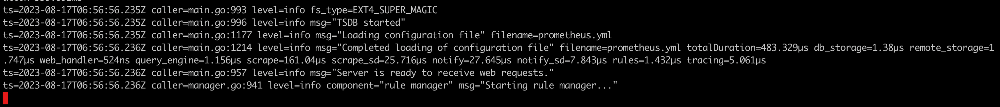
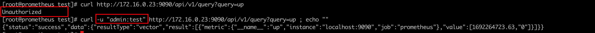

### 一: Prometheus Basic Auth

背景: 在日常prometheus的使用中是没有安全加密措施的，不安全。指标信息直接暴露在公网上了。

现在可以通过Prometheus 内置的basic auth功能进行加密，在浏览器登录UI的时候需要输入用户密码，访问api的时候也需要加上用户密码

可参考: https://prometheus.io/docs/guides/basic-auth/

在prometheus的日常使用中，通常有三种方式

1. 二进制直接在虚机上部署
2. 容器化部署在集群中
3. 通过kube-prometheus部署

三种不同方式安装的prometheus，配置basic auth的方式也略有差异


### 二： 设置哈希密码

访问 Prometheus 实例的所有用户都需要用户名和密码。密码需要加盐加密，我们使用python工具进行生成

1. 安装python环境

   `apt install python3-bcrypt`	

2. Python 脚本如下

   ```python
   import getpass
   import bcrypt
   
   password = getpass.getpass("password: ")
   hashed_password = bcrypt.hashpw(password.encode("utf-8"), bcrypt.gensalt())
   print(hashed_password.decode())
   ```

   

3. 运行脚本，假如我们需要的密码为: test。

   执行脚本后，需要我们手动键入需要使用的密码，在终端键入的时候不显示

   

   保存密码备用: `$2b$12$kXxrZP74Fmjh6Wih0Ignu.uWSiojl5aKj4UnMvHN9s2h/Lc/ui0.S`

 

### 二：prometheus 二进制部署添加basic auth

1. 创建web.yml

   ```yml
   basic_auth_users:
     admin: $2b$12$kXxrZP74Fmjh6Wih0Ignu.uWSiojl5aKj4UnMvHN9s2h/Lc/ui0.S
   ```

   


2. 启动prometheus

   `./prometheus  --web.config.file=webconfig.yml --config.file=prometheus.yml`

   其中 --web.config.file=webconfig.yml 为关键配置，prometheus 启动后会要求 带密码访问

   启动成功:

    

3. 访问prometheus UI

   要求输入用户密码信息

    

4. 访问prometheus http API接口

   

   带用户信息访问:

   


### 三: 容器化部署如何添加basic auth

可以看到能直接访问到prometheus 的queryAPI和UI界面


如果需要给UI和 prometheus API 添加basic auth，那么该如何做呢？


1.确认prom的版本信息，低版本的prometheus 不支持配置basic auth


存在该启动命令，即可配置basic auth。（之前踩过坑，2.10的prometheus 中没有该启动命令，导致配置了baisc auth后，prometheus 启动失败）


2. 创建configmap

   复用上述的webconfig.yml

   `kubectl  -n monitoring create configmap webconfig --from-file=webconfig.yml `

   

3. 将configmap挂载给prometheus 实例

   有三处修改点。

   需要修改volume配置，即增加configmap的挂载

   ```yaml
    volumes:
    - configMap:
        name: webconfig
      name: basic-auth
   ```

   

   需要将配置挂载给prometheus容器,添加挂载点

   ```yaml
    volumeMounts:
    - mountPath: /etc/prometheus/basicauth
      name: basic-auth
   ```

    

   需要修改启动命令，添加 web.config.file

   ```yaml
   - --web.config.file=/etc/prometheus/basicauth/webconfig.yml
   ```

   

4. 修改完成后，查看prometheus 实例状态

    

   访问prometheus的queryAPI，发现如果不带用户信息，则访问失败。basic auth生效

    

   访问Prometheus UI

    

   

5. 总结

   容器化部署的prometheus 修改逻辑其实和二进制相同。将对应的basic auth 信息传递给prometheus，然后启动加载就可以了。

   期间踩过坑，版本低的prometheus 加载失败，会打印错误日志: ` unknow long flag '--web.config.file'`

#### 

### 四: kube-prometheus形态添加basic auth

当前在k8s 部署prometheus 大都选择kube-prometheus这种形式，配置文件的变更都是交由crd进行管理。统一由prometheus-operator进行识别转换


1. 查看对应的prometheus实例，并访问http API

   

   默认是不带鉴权的。

2. 查看prometheus crd 的配置，发现没有web.config.file 相关可以配置的地方

   当前kube-prometheus 还不支持配置basic auth，详情可见https://github.com/prometheus-operator/prometheus-operator/issues/5765

   

3. 规避方案

   借助nginx-ingress的能力配置basic auth。nginx ingress 在这方面非常灵活。

   

   即创建ingress 来实现。再创建ingress之前，我们需要先准备auth-secret

   执行下述命令之前 可以先安装 工具: `yum -y install httpd`

   ```bash
   $ htpasswd -c auth admin
   New password:  test
   New password:
   Re-type new password:
   Adding password for user admin
   ```

    

   使用auth文件创建secret: `kubectl create secret generic basic-auth --from-file=auth`

   

   

4. 给prometheus创建ingress访问入口

   ⚠️: 由于我使用的k8s版本是1.21，ingress的写法会有所不同，1.22以后，ingress的api也不再是networking.k8s.io/v1beta1

   ```yaml
   # ingress-prom.yaml
   apiVersion: networking.k8s.io/v1beta1
   kind: Ingress
   metadata:
     annotations:
       nginx.ingress.kubernetes.io/auth-realm: Authentication Required
       nginx.ingress.kubernetes.io/auth-secret: basic-auth
       nginx.ingress.kubernetes.io/auth-type: basic
       kubernetes.io/ingress.class: nginx
     name: prometheus-k8s
     namespace: monitoring
   spec:
     rules:
     - host: prometheus.example.com
       http:
         paths:
         - backend:
             serviceName: prometheus-k8s
             servicePort: 9090
           path: /
           pathType: Prefix
   ```

   


 

5. 访问queryAPI&prometheus UI

   可以发现queryAPI已经被限制登录

   

   

   

   同时也可以发现，访问UI已经限制登录鉴权

   

   

   输入用户和密码后即可登录

   

   

6. 高版本的k8s ingress写法可参考

   ```yaml
   
   apiVersion: networking.k8s.io/v1
   kind: Ingress
   metadata:
     annotations:
       nginx.ingress.kubernetes.io/auth-realm: Authentication Required
       nginx.ingress.kubernetes.io/auth-secret: basic-auth
       nginx.ingress.kubernetes.io/auth-type: basic
       kubernetes.io/ingress.class: nginx
     name: prometheus-k8s
     namespace: monitoring
   spec:
     rules:
     - host: prometheus.example.com
       http:
         paths:
         - backend:
             service:
               name: prometheus-k8s
               port:
                 name: web
           path: /
           pathType: Prefix
   ```

   
