### 一: Prometheus Basic Auth

背景: 在日常prometheus的使用中是没有安全加密措施的，不安全。指标信息直接暴露在公网上了。

现在可以通过Prometheus 内置的basic auth功能进行加密，在浏览器登录UI的时候需要输入用户密码，访问api的时候也需要加上用户密码

可参考: https://prometheus.io/docs/guides/basic-auth/

在prometheus的日常使用中，通常有三种方式

1. 二进制直接在虚机上部署
2. 容器化部署在集群中
3. 通过kube-prometheus部署

三种不同方式安装的prometheus，配置basic auth的方式也略有差异


### 二： 设置登录用户和密码

访问 Prometheus 实例的所有用户都需要用户名和密码。密码需要加盐加密，我们使用python工具进行生成

1. 安装python环境

   `apt install python3-bcrypt`	

2. Python 脚本如下

   ```python
   import getpass
   import bcrypt
   
   password = getpass.getpass("password: ")
   hashed_password = bcrypt.hashpw(password.encode("utf-8"), bcrypt.gensalt())
   print(hashed_password.decode())
   ```

   

3. 运行脚本，假如我们需要的密码为: test。

   执行脚本后，需要我们手动键入需要使用的密码，在终端键入的时候不显示

   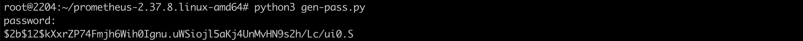

   保存密码备用: `$2b$12$kXxrZP74Fmjh6Wih0Ignu.uWSiojl5aKj4UnMvHN9s2h/Lc/ui0.S`
   
   

---


### 三：prometheus 二进制部署添加basic auth

1. 创建web.yml

   ```yml
   basic_auth_users:
     admin: $2b$12$kXxrZP74Fmjh6Wih0Ignu.uWSiojl5aKj4UnMvHN9s2h/Lc/ui0.S
   ```

   


2. 启动prometheus

   `./prometheus  --web.config.file=webconfig.yml --config.file=prometheus.yml`

   其中 --web.config.file=webconfig.yml 为关键配置，prometheus 启动后会要求 带密码访问

   启动成功:

    

3. 访问prometheus UI

   要求输入用户密码信息

    

4. 访问prometheus http API接口

   

   带用户信息访问:

   

---


### 四: 容器化部署如何添加basic auth

可以看到能直接访问到prometheus 的queryAPI和UI界面


如果需要给UI和 prometheus API 添加basic auth，那么该如何做呢？


1.确认prom的版本信息，低版本的prometheus 不支持配置basic auth


存在该启动命令，即可配置basic auth。（之前踩过坑，2.10的prometheus 中没有该启动命令，导致配置了baisc auth后，prometheus 启动失败）


2. 创建configmap

   复用上述的webconfig.yml

   `kubectl  -n monitoring create configmap webconfig --from-file=webconfig.yml `

   

3. 将configmap挂载给prometheus 实例

   有多处修改点。

   需要修改volume配置，即增加configmap的挂载

   ```yaml
    volumes:
    - configMap:
        name: webconfig
      name: basic-auth
   ```

   

   需要将配置挂载给prometheus容器,添加挂载点

   ```yaml
    volumeMounts:
    - mountPath: /etc/prometheus/basicauth
      name: basic-auth
   ```

    

   需要修改启动命令，添加 web.config.file

   ```yaml
   - --web.config.file=/etc/prometheus/basicauth/webconfig.yml
   ```

   

   修改完上述配置后，还得看情况继续修改探针配置。。。

   

4. **修改探针配置(**如果有健康检查相关配置的话)

   同时还需要检查prometheus负载 是否有存活探针livenessProbe,和就绪探针readinessProbe相关配置。如果配置了探针，则需要对探针信息进行修改，添加访问头信息。否则会报错:

   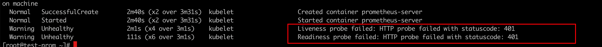

   因为kubelet探针需要访问prometheus接口，进行存活和就绪检测。如果配置了httpGet探针，不对探针进行httpHeaders配置，就会引起pod不断重启，无法正常运行。

   

   ⚠️⚠️**修改方式如下:**

   首先需要对 用户名和明文密码进行 Base64编码处理,例如我设置的basicauth信息是: `admin:test`

   则需要`echo -n "admin:test" |base64 -w0` ,编码后的信息为: `YWRtaW46dGVzdA==` ，保存备用

   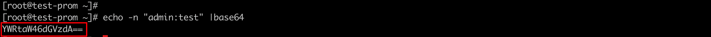

   然后继续编辑Prometheus负载配置:

   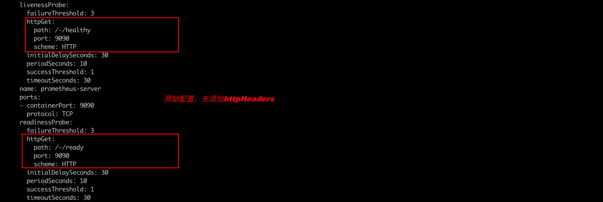

   在livenessProbe.httpGet/readinessProbe.httpGet中添加:

   ```yaml
   httpGet: 
     httpHeaders:
     - name: Authorization
       value: Basic YWRtaW46dGVzdA==
   ```

   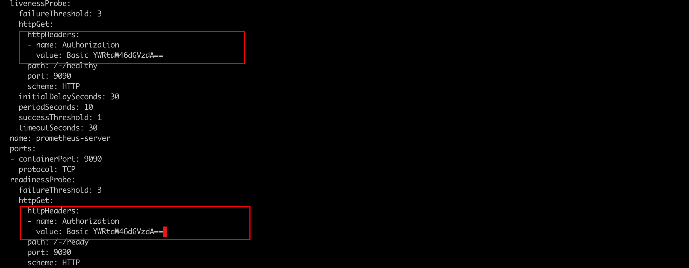

   ⚠️修改完成后，保存退出负载配置。然后手动重启pod实例。（貌似修改探针，pod不会自动重启？）

   

5. 修改完成后，查看prometheus 实例状态。实例就绪

   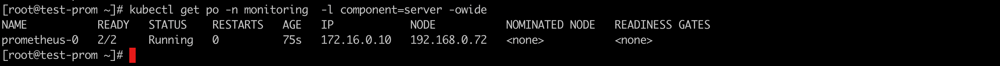 

   访问prometheus的queryAPI，发现如果不带用户信息，则访问失败。basic auth生效

   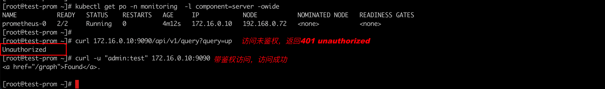 

   访问Prometheus UI: 需要带用户鉴权，否则无法访问

    

   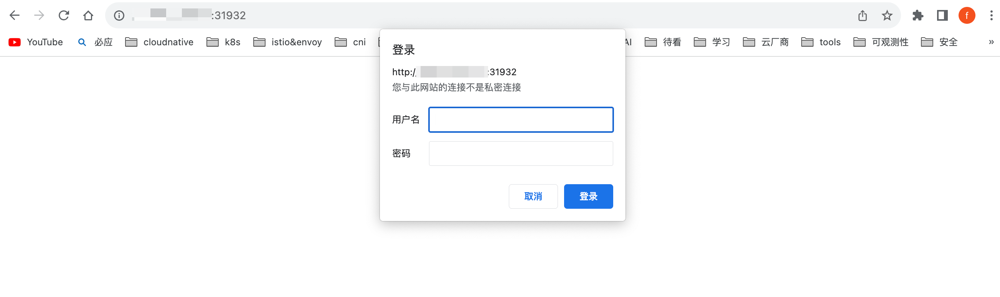

   

   

6. 总结

   容器化部署的prometheus 修改逻辑其实和二进制相同。将对应的basic auth 信息传递给prometheus，然后启动加载就可以了。

   期间踩过坑，版本低的prometheus 加载失败，会打印错误日志: ` unknow long flag '--web.config.file'`

   ⚠️期间踩过坑, 如果prometheus在部署的时候配置了存活探针和就绪探针，不对探针进行httpHeaders的配置，则会造成prometheus实例无法正常运行。

   

---


### 五: kube-prometheus形态添加basic auth

当前在k8s 部署prometheus 大都选择kube-prometheus这种形式，配置文件的变更都是交由crd进行管理。统一由prometheus-operator进行识别转换


1. 查看对应的prometheus实例，并访问http API

   

   默认是不带鉴权的。

2. 查看prometheus crd 的配置，发现没有web.config.file 相关可以配置的地方

   当前kube-prometheus 还不支持配置basic auth，详情可见https://github.com/prometheus-operator/prometheus-operator/issues/5765

   

3. 规避方案

   借助nginx-ingress的能力配置basic auth。nginx ingress 在这方面非常灵活。

   

   即创建ingress 来实现。再创建ingress之前，我们需要先准备auth-secret

   执行下述命令之前 可以先安装 工具: `yum -y install httpd`

   ```bash
   $ htpasswd -c auth admin
   New password:  test
   New password:
   Re-type new password:
   Adding password for user admin
   ```

    

   使用auth文件创建secret: `kubectl create secret generic basic-auth --from-file=auth`

   

   

4. 给prometheus创建ingress访问入口

   ⚠️: 由于我使用的k8s版本是1.21，ingress的写法会有所不同，1.22以后，ingress的api也不再是networking.k8s.io/v1beta1

   ```yaml
   # ingress-prom.yaml
   apiVersion: networking.k8s.io/v1beta1
   kind: Ingress
   metadata:
     annotations:
       nginx.ingress.kubernetes.io/auth-realm: Authentication Required
       nginx.ingress.kubernetes.io/auth-secret: basic-auth
       nginx.ingress.kubernetes.io/auth-type: basic
       kubernetes.io/ingress.class: nginx
     name: prometheus-k8s
     namespace: monitoring
   spec:
     rules:
     - host: prometheus.example.com
       http:
         paths:
         - backend:
             serviceName: prometheus-k8s
             servicePort: 9090
           path: /
           pathType: Prefix
   ```

   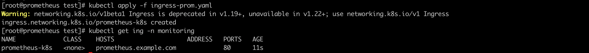


 

5. 访问queryAPI&prometheus UI

   可以发现queryAPI已经被限制登录

   

   

   

   同时也可以发现，访问UI已经限制登录鉴权

   

   

   输入用户和密码后即可登录

   

   

6. 高版本的k8s ingress写法可参考

   ```yaml
   
   apiVersion: networking.k8s.io/v1
   kind: Ingress
   metadata:
     annotations:
       nginx.ingress.kubernetes.io/auth-realm: Authentication Required
       nginx.ingress.kubernetes.io/auth-secret: basic-auth
       nginx.ingress.kubernetes.io/auth-type: basic
       kubernetes.io/ingress.class: nginx
     name: prometheus-k8s
     namespace: monitoring
   spec:
     rules:
     - host: prometheus.example.com
       http:
         paths:
         - backend:
             service:
               name: prometheus-k8s
               port:
                 name: web
           path: /
           pathType: Prefix
   ```

   

---

### 六: Grafana 如何对接鉴权之后的Prometheus

正常来说，如果对Prometheus配置了Basic Auth后，所有需要访问Prometheus的组件均需做出调整，否则无法获取数据。Grafana也不例外

1. 登录Grafana UI, 初次登录需要填写grafana的用户密码,默认是`admin:admin`

   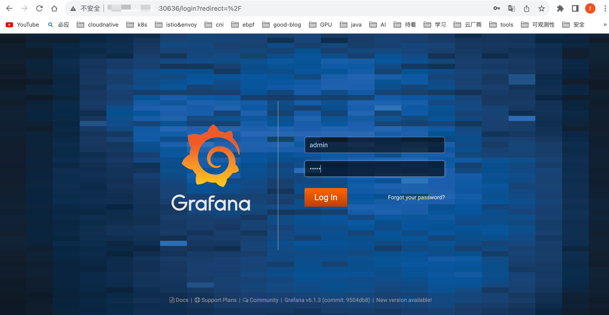 

    

2. 确认数据源配置,并对数据源进行配置

   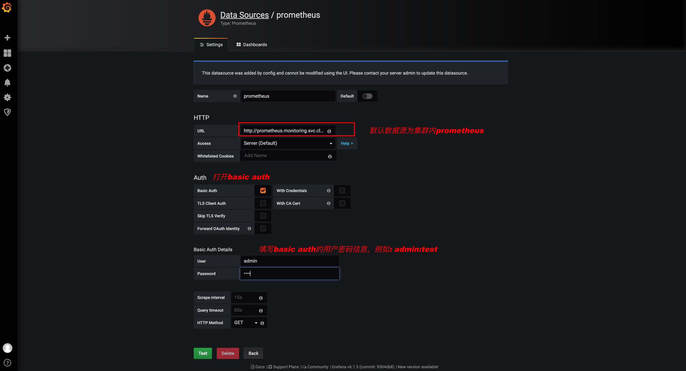 

   

3. 配置完成后，点击正下方绿色按钮Test，测试数据源的联通性（不出意外，联通失败☹️）

   如果没失败，就万事大吉，无需在往下看了。恭喜你完成对接。

   失败了请看下面，如何解决:

   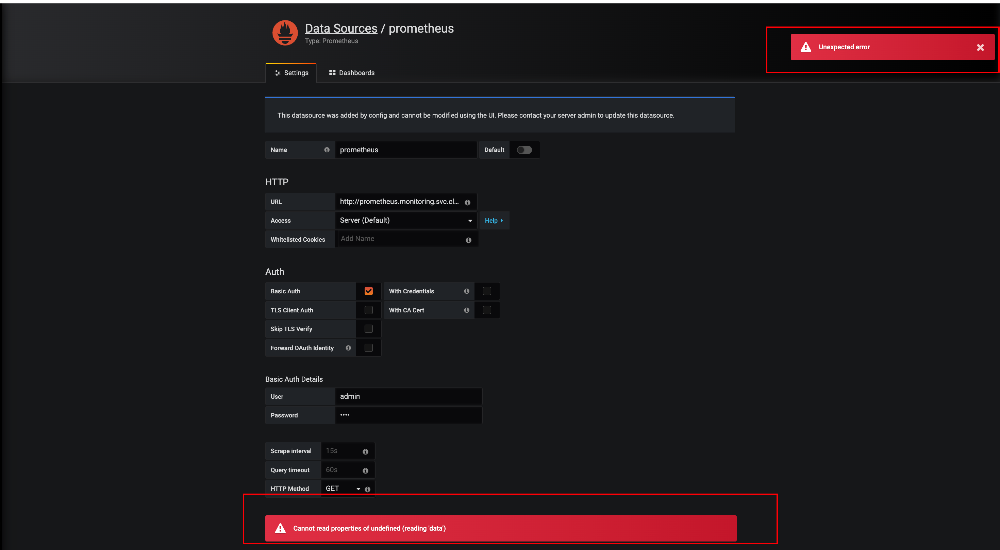 

   

4. 查看monitoring命名空间中grafana-datasource的configmap配置

   `kubectl get cm -n monitoring  |grep grafana-datasources`

   

   

   编辑该配置项:`kubectl edit cm grafana-datasources -n monitoring`

   将 `editable: false`  设置为 : `editable: true`

   修改的原因是因为 grafana内置了默认的数据源，且数据源不允许修改。我们需要调整这个默认的规定

   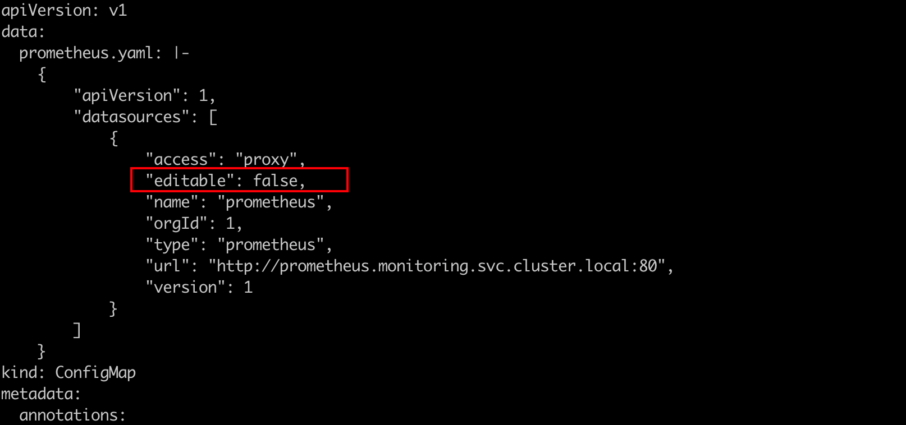 

   

5. 手动重启grafana实例

   cm修改完成后，无法动态加载配置，需要手动重启grafana实例加载新配置。 

   如果grafana没做持久化处理，之前手动配置的dashboard可能会因为重启grafana实例而丢失，建议备份dashboard，dashboard可由grafana页面以json格式导出

   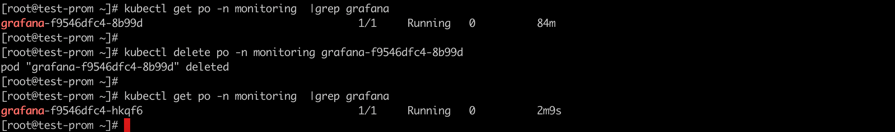 

   

6. 再次访问Grafana UI

   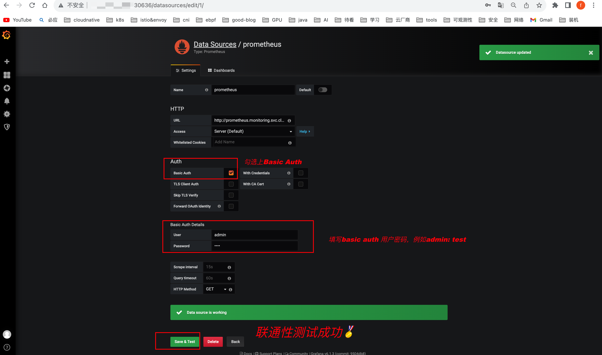 

   查看dashboard信息:

   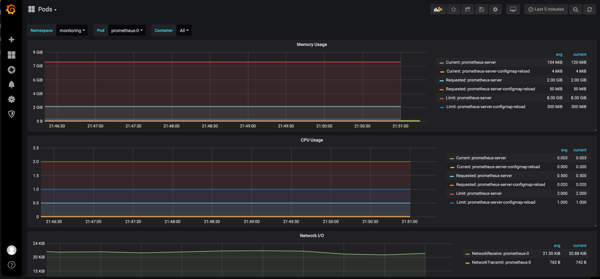 

   

   Ok,大功告成！

---


### 七: Grafana 如何取消匿名登录

🔐 正常情况下，Grafana的监控信息应该需要用户才能登录显示对接数据源指标的显示。如果谁都能登录查看，容器造成信息泄漏等安全问题

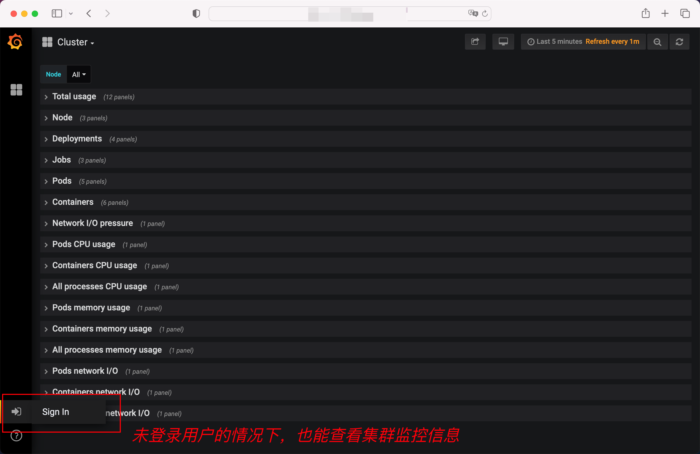  

如何才能实现Grafana的安全登录功能呢？

1. 查看集群中monitoring ns下的grafana-conf 配置项

   `kubectl get cm -n monitoring |grep grafana-conf`

    

2. 编辑该配置项

   `kubectl edit cm -n monitoring grafana-conf` 

   根据关键字找到 `auth.anonymous`配置，将enabled = true 设置为 fale

   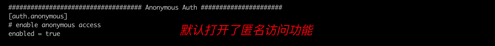

3. 重启grafana 实例

   修改配置后，需要重启grafana实例，加载配置（如果没做持久化处理，注意备份相关dashboard）

   

4. 刷新grafana页面，重新登录

   可以发现，再次登录页面，都需要填写用户信息了

   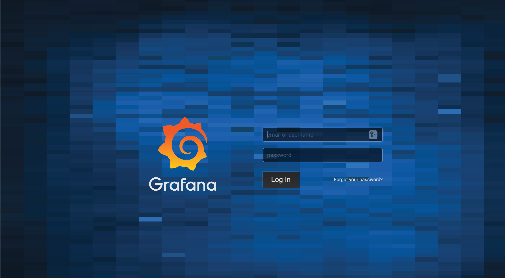  

---

### 八: Prometheus BasicAuth 可以添加多用户

现实场景下,prometheus的baisc auth信息可能存在多个。

例如我之前添加的basic auth 只用一个鉴权用户: `admin: test`; 现在如果想添加新的鉴权用户:  `mike: hello` 

我们先用python3 工具生成hello 字段加密后的样子:  `$2b$12$qhdgpdq669cXNW4DLqRfI.JIBJ0KIvvf0I.I3ccie/tn8d4BxzqV2`

此时只需要前往之前设置的webconfig 这个configmap中添加该信息即可:

`kubectl edit cm  webconfig -n monitoring`

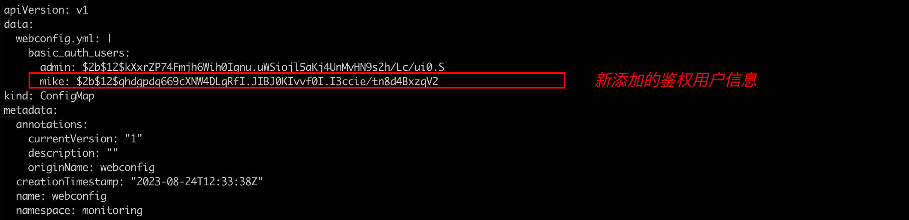 

修改完成后，使用prometheus的热加载命令加载新配置:

`curl -u "admin:test"  -XPOST http://ip:9090/-/reload`

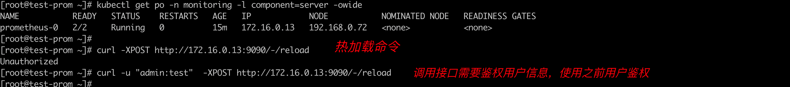


多用户访问生效

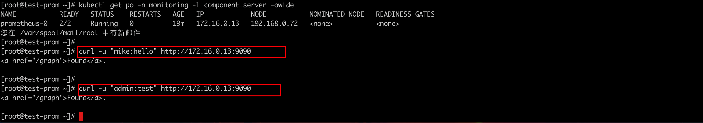
