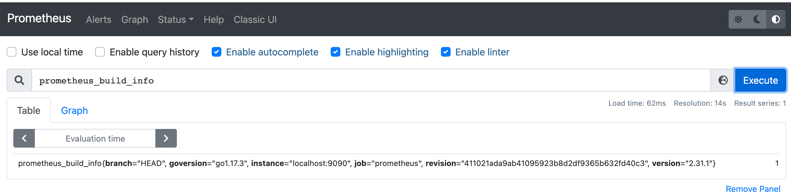

### 一：prometheus容器化部署

在实际生产环境来说，Prometheus 更适合用来部署在 Kubernetes 集群中。接下来我们step by step 实现如何在k8s部署prometheus。

本次环境信息为: kubernetes 1.21。本次搭建主要是为了测试需要，不会对数据进行持久化处理


### 二:具体步骤

1. 创建配置文件configmap

   该部分内容主要包括，各种抓取规则的配置。集群内有各种exporter的加入，我们就需要在该配置文件进行增删改查.

   当前只对自身进行监控

   ```yaml
   # config.yaml
   apiVersion: v1
   kind: ConfigMap
   metadata:
     name: prometheus-config
     namespace: monitoring
   data:
     prometheus.yml: |
       global:
         scrape_interval: 15s
         scrape_timeout: 15s
       scrape_configs:
       - job_name: 'prometheus'
         static_configs:
         - targets: ['localhost:9090']
   ```

   

2. 创建工作负载，这里演示使用deployment进行管理，正常来说推荐statefulset进行pod管理

   ```yaml
   # prometheus-deploy.yaml
   apiVersion: apps/v1
   kind: Deployment
   metadata:
     name: prometheus
     namespace: monitoring
     labels:
       app: prometheus
   spec:
     selector:
       matchLabels:
         app: prometheus
     template:
       metadata:
         labels:
           app: prometheus
       spec:
         serviceAccountName: prometheus
         containers:
           - image: prom/prometheus:v2.31.1
             name: prometheus
             args:
               - '--config.file=/etc/prometheus/prometheus.yml'
               - '--storage.tsdb.path=/prometheus' # 指定tsdb数据路径
               - '--storage.tsdb.retention.time=24h'
               - '--web.enable-admin-api' # 控制对admin HTTP API的访问，其中包括删除时间序列等功能
               - '--web.enable-lifecycle' # 支持热更新，直接执行localhost:9090/-/reload立即生效
             ports:
               - containerPort: 9090
                 name: http
             volumeMounts:
               - mountPath: '/etc/prometheus'
                 name: config-volume
              
             resources:
               requests:
                 cpu: 200m
                 memory: 1024Mi
               limits:
                 cpu: 200m
                 memory: 1024Mi
         volumes:
           - configMap:
               name: prometheus-config
             name: config-volume
   ---
   apiVersion: v1
   kind: Service
   metadata: 
     name: prometheus-np
     namespace: monitoring 
   spec:
     type: NodePort
     ports: 
     - port: 9090
       targetPort: 9090
     selector:
       app: prometheus
   ```

   

   

3. 由于prometheus抓取集群内指标信息，需要有对应资源的rbac权限

   ```yaml
   # rbac.yaml
   apiVersion: v1
   kind: ServiceAccount
   metadata:
     name: prometheus
     namespace: monitoring
   ---
   apiVersion: rbac.authorization.k8s.io/v1
   kind: ClusterRole
   metadata:
     name: prometheus
   rules:
     - apiGroups:
         - ''
       resources:
         - nodes
         - services
         - endpoints
         - pods
         - nodes/proxy
       verbs:
         - get
         - list
         - watch
     - apiGroups:
         - 'extensions'
       resources:
         - ingresses
       verbs:
         - get
         - list
         - watch
     - apiGroups:
         - ''
       resources:
         - configmaps
         - nodes/metrics
       verbs:
         - get
     - nonResourceURLs:
         - /metrics
       verbs:
         - get
   ---
   apiVersion: rbac.authorization.k8s.io/v1
   kind: ClusterRoleBinding
   metadata:
     name: prometheus
   roleRef:
     apiGroup: rbac.authorization.k8s.io
     kind: ClusterRole
     name: prometheus
   subjects:
     - kind: ServiceAccount
       name: prometheus
       namespace: monitoring
   ```

   

4. 访问prometheus UI

   