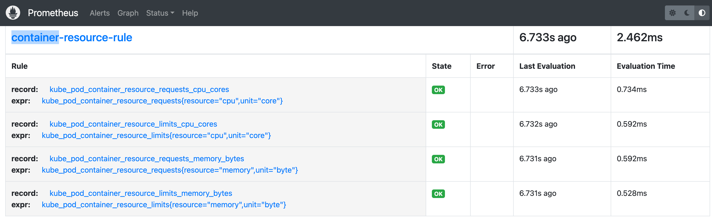
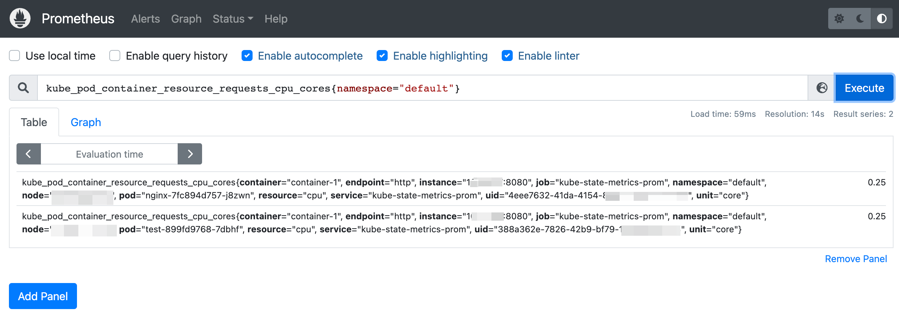
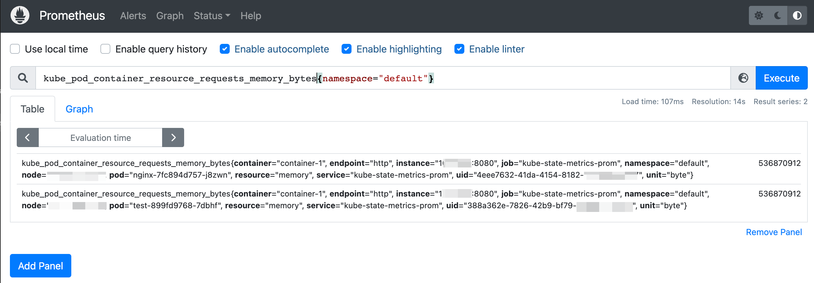

### 一: 背景

Kube-state-metrics组件版本更新,部分指标名称进行优化处理(指标名称进行裁剪，资源信息下沉到指标标签展示)。因用户程序未同步进行修改，导致查询失败。

以下指标已于kube-state-metrics v2.0.0-alpha.2 版本正式移除指标:

`kube_pod_container_resource_requests_cpu_cores`

`kube_pod_container_resource_requests_memory_bytes`

`kube_pod_container_resource_limits_cpu_cores`

`kube_pod_container_resource_limits_memory_bytes`

开始由以下指标+标签提供容器资源相关数据:

`kube_pod_container_resource_requests{resource="cpu",unit="core"}`

`kube_pod_container_resource_requests{resource="memory",unit="byte"}`

`kube_pod_container_resource_limits{resource="cpu",unit="cpu"}`

`kube_pod_container_resource_limits{resource="memory",unit="byte"}`


### 二: 解决方案

- 创建PrometheusRule 自定义资源，实现新老指标的映射。无需修改应用程序，同时也无需回退组件版本。新老指标均在线提供，也方便后续用户切换使用新指标

⚠️: k8s集群中采用kube-prometheus-stack 形式部署prometheus全家桶。


### 三: 方案详情

1. 创建PrometheusRule

   `kubectl apply -f xxx.yaml`

   ```yaml
   apiVersion: monitoring.coreos.com/v1
   kind: PrometheusRule
   metadata:
     labels:
       role: operator-prometheus  #该项配置请与promethueus crd中的ruleselector保持一致，否则规则无法生效
     name: pod-resource-rule
     namespace: monitoring
   spec:
     groups:
     - interval: 15s   #评估规则频率
       name: container-resource-rule
       rules:
       - expr: kube_pod_container_resource_requests{resource="cpu",unit="core"}
         record: kube_pod_container_resource_requests_cpu_cores
       - expr: kube_pod_container_resource_limits{resource="cpu",unit="core"}
         record: kube_pod_container_resource_limits_cpu_cores
       - expr: kube_pod_container_resource_requests{resource="memory",unit="byte"}
         record: kube_pod_container_resource_requests_memory_bytes
       - expr: kube_pod_container_resource_limits{resource="memory",unit="byte"}
         record: kube_pod_container_resource_limits_memory_bytes
   ```

   

2. 前往prometheus UI界面查看Rule规则

   查看规则是否加载成功: 已加载成功

   


3. 指标验证

   指标数据如下，通过老指标名称进行查询，均能正常返回数据

   `kube_pod_container_resource_requests_cpu_cores`

    

   `kube_pod_container_resource_requests_memory_bytes`

    

4. 以下是新指标名称，对比验证，数据一致

    

   

### 四: 总结

思路很重要，之前想通过metrics_relabeling来进行指标的重命名(通过匹配指标名称和指标标签，发现满足条件的指标名称，再进行重命名)，这样的方式证实不可行，同时也会将新指标名称修改掉，无法保持两个名称同时在线。同时通过PrometheusRule也简化了修改的复杂度。

